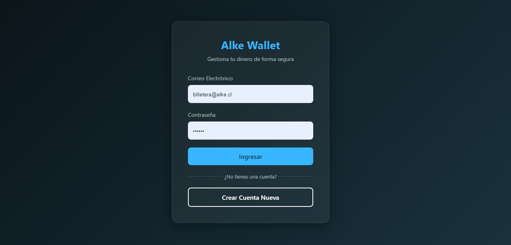
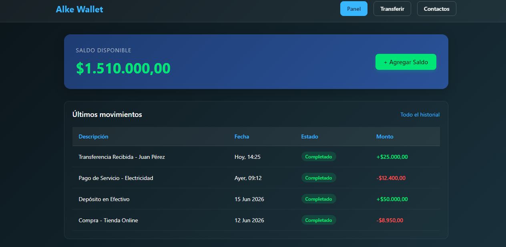

# 💳 Alke-Wallet

Un prototipo de interfaz web para una billetera virtual. Este proyecto emula las funcionalidades principales de una plataforma financiera, permitiendo visualizar un panel de control de usuario, saldo disponible y pantallas de acceso.

## 🚀 Características

* **Pantalla de Inicio de Sesión:** Interfaz de login para el acceso de usuarios.
* **Dashboard Principal:** Vista general que muestra el balance de la cuenta y los accesos a operaciones principales.
* **Diseño Responsivo:** Interfaz adaptable tanto para visualización en computadoras de escritorio como en dispositivos móviles.

## 🛠️ Tecnologías Utilizadas

* **HTML5:** Estructuración semántica del contenido.
* **CSS3:** Estilos personalizados y diseño visual (incluyendo efectos como *Glassmorphism* si aplica).
* **Bootstrap:** Framework de diseño para agilizar la responsividad y los componentes de la interfaz.

## 📸 Capturas de Pantalla


| Login | Dashboard |
|---|---|
|  |  |

## 💻 Instalación y Ejecución Local

Para visualizar este proyecto en tu máquina local, sigue estos pasos:

1. Clona este repositorio usando Git:
   ```bash
   git clone [https://github.com/sotopereznico/Alke-Wallet.git](https://github.com/sotopereznico/Alke-Wallet.git)


## Nicolás Soto - Desarrollo inicial - sotopereznico
